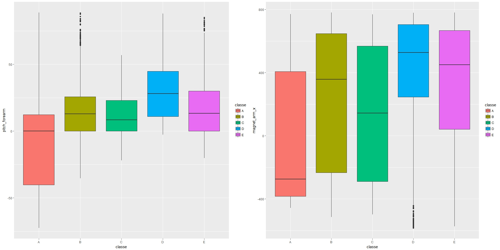
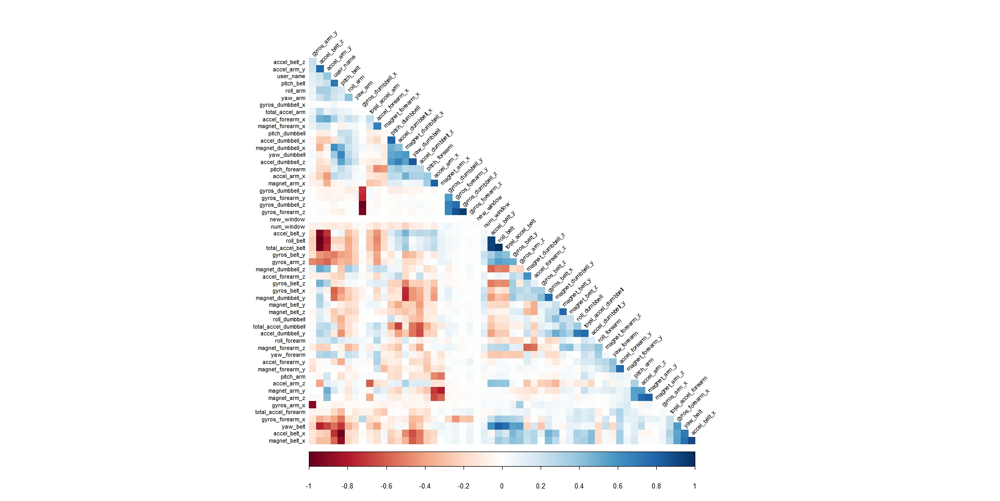
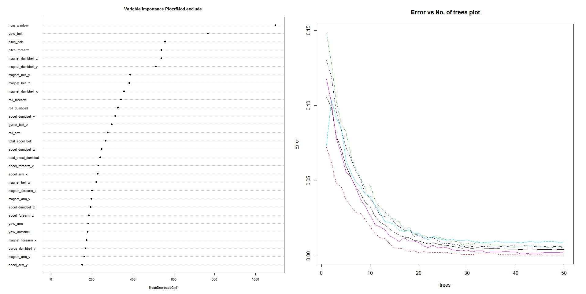

# Predictions using the Weight Lifting Exercises Dataset
Wrichik Biswas  
26 July 2017  


## Executive Summary

Based on a dataset provide by HAR [http://groupware.les.inf.puc-rio.br/har](http://groupware.les.inf.puc-rio.br/har) we will try to train a predictive model to predict what exercise was performed using a dataset with 159 features


I'll take the following steps:

- Process the data, to use in this project
- Explore the data, and focussing on the data I want to use
- Model selection, where I try to use different models to help me answer the questions given to me
- Model examination, to see whether the best model holds up to my standards
- A Conclusion where I answer the questions based on the data
- Predict the classification of the model for test data set

## Processing

First change 'am' to  factor (0 = automatic, 1 = manual)
And make cylinders a factor as well (since it is not continious)


```r
training.raw<-read.csv("pml-training.csv")
testing.raw<-read.csv("pml-testing.csv")
```

## Initial data analyses 

Look at the dimensions and head of the dataset to get an idea

```r
# Res 1
dim(training.raw)
```

```
[1] 19622   160
```


What we see is a lot of data with NA / empty values. Let's remove those from the traning dataset


```r
maxNAPerc=20
maxNACount<-nrow(training.raw)/100*maxNAPerc
removeColumns<-which(colSums(is.na(training.raw)|training.raw=="")>maxNACount)
training.cleaned01<-training.raw[,-removeColumns]
testing.cleaned01<-testing.raw[,-removeColumns]
```

Now remove all time data because that is not needed for this project


```r
removeColumns<-grep("timestamp",names(training.cleaned01))
training.cleaned02<-training.cleaned01[,-c(1,removeColumns)]
testing.cleaned02<-testing.cleaned01[,-c(1,removeColumns)]
```

Then convert all factors to integer values

```r
classeLevels<-levels(training.cleaned02$classe)
training.cleaned03< data.frame(data.matrix(training.cleaned02))
training.cleaned03$classe<-factor(training.cleaned03$classe,labels=classeLevels)
testing.cleaned03<-data.frame(data.matrix(testing.cleaned02))
```

Finally set the dataset to be used for analysis


```r
training.cleaned<-training.cleaned03
testing.cleaned<-testing.cleaned03
```


## Exploratory data analyses 

Since the test dataset provided is the the ultimate validation set, we will split the current training set into a testing and training set to work with.


```r
set.seed(19791108)
library(caret)
classeIndex<-which(names(training.cleaned)=="classe")
partition<-createDataPartition(y=training.cleaned$classe,p=0.75,list=FALSE)
training.subSetTrain<-training.cleaned[partition,]
training.subSetTest<-training.cleaned[-partition,]
```

What are some fields that have high correlations with the classe?


```r
correlations<-cor(training.subSetTrain[,-classeIndex],as.numeric(training.subSetTrain$classe))
bestCorrelations<-subset(as.data.frame(as.table(correlations)),abs(Freq)>0.3)
bestCorrelations
```

```
            Var1 Var2      Freq
27  magnet_arm_x    A 0.3023806
44 pitch_forearm    A 0.3475548
```

Even the best correlations with classe are hardly above 0.3
Let's check visually if there is indeed hard to use these 2 as possible simple linear predictors.


```r
library(Rmisc)
library(ggplot2)
p1<-ggplot(training.subSetTrain,aes(classe,pitch_forearm))+geom_boxplot(aes(fill=classe))
p2<-ggplot(training.subSetTrain,aes(classe,magnet_arm_x))+geom_boxplot(aes(fill=classe))
multiplot(p1,p2,cols=2)
```



Clearly there is no hard seperation of classes possible using only these 'highly' correlated features.
Let's train some models to get closer to a way of predicting these classe's

## Model selection 

Let's look at the variables with high correlations amongst each other in our data set, so I may possibly ignore them during the pca or training. 

I will determine afterwards if these changes to the dataset make the model more accurate and possibly faster.


```r
library(corrplot)
correlationMatrix<-cor(training.subSetTrain[,-classeIndex])
highlyCorrelated<-findCorrelation(correlationMatrix,cutoff=0.9,exact=TRUE)
excludeColumns<-c(highlyCorrelated,classeIndex)
corrplot(correlationMatrix,method="color",type="lower",order="hclust",tl.cex=0.70,tl.col="black",tl.srt=45,diag=FALSE)
```



I see that there are some features that have a high correlation with each other.
I will have a model with these ignored. Also I'll try and reduce the features by running PCA on all and the excluded subset of the features


```r
pcaPreProcess.all<-preProcess(training.subSetTrain[,-classeIndex],method="pca",thresh=0.99)
training.subSetTrain.pca.all<-predict(pcaPreProcess.all,training.subSetTrain[,-classeIndex])
training.subSetTest.pca.all<-predict(pcaPreProcess.all,training.subSetTest[,-classeIndex])
testing.pca.all<-predict(pcaPreProcess.all,testing.cleaned[,-classeIndex])
pcaPreProcess.subset<-preProcess(training.subSetTrain[,-excludeColumns],method="pca",thresh=0.99)
training.subSetTrain.pca.subset<-predict(pcaPreProcess.subset,training.subSetTrain[,-excludeColumns])
training.subSetTest.pca.subset<-predict(pcaPreProcess.subset,training.subSetTest[,-excludeColumns])
testing.pca.subset<-predict(pcaPreProcess.subset,testing.cleaned[,-classeIndex])
```

I'll do some actual Random Forest training now.
I'll be using 50 trees, because I've already seen that the error rate doesn't decline a lot after 35 trees, but I still want to be as thorough as possible while still not running into RAM limitations.
This is because the machine I am using only has 8 GB of RAM.
Also I will time all of the 4 random forest models to see if when everything else is equal, one comes out as the faster one.


```r
library(randomForest)

ntree<-50

start<-proc.time()
rfMod.cleaned<-randomForest(
  x=training.subSetTrain[,-classeIndex], 
  y=training.subSetTrain$classe,
  xtest=training.subSetTest[,-classeIndex], 
  ytest=training.subSetTest$classe, 
  ntree=ntree,
  keep.forest=TRUE,
  proximity=TRUE)
proc.time()-start
```

```
   user  system elapsed 
  31.75    3.58   36.14 
```

```r
start<-proc.time()
rfMod.exclude<-randomForest(
  x=training.subSetTrain[,-excludeColumns], 
  y=training.subSetTrain$classe,
  xtest=training.subSetTest[,-excludeColumns], 
  ytest=training.subSetTest$classe, 
  ntree=ntree,
  keep.forest=TRUE,
  proximity=TRUE)
proc.time()-start
```

```
   user  system elapsed 
  31.90    3.42   35.39 
```

```r
start<-proc.time()
rfMod.pca.all<-randomForest(
  x=training.subSetTrain.pca.all, 
  y=training.subSetTrain$classe,
  xtest=training.subSetTest.pca.all, 
  ytest=training.subSetTest$classe, 
  ntree=ntree,
  keep.forest=TRUE,
  proximity=TRUE)
proc.time()-start
```

```
   user  system elapsed 
  31.19    2.91   34.09 
```

```r
start<-proc.time()
rfMod.pca.subset<-randomForest(
  x=training.subSetTrain.pca.subset, 
  y=training.subSetTrain$classe,
  xtest=training.subSetTest.pca.subset, 
  ytest=training.subSetTest$classe, 
  ntree=ntree,
  keep.forest=TRUE,
  proximity=TRUE) #do.trace=TRUE
proc.time()-start
```

```
   user  system elapsed 
  31.12    3.30   34.61 
```

## Model examination

Now that I have 4 trained models, we will check the accuracy of each one.
(There is probably a better way, but this still works fine)


```r
rfMod.cleaned
```

```

Call:
 randomForest(x = training.subSetTrain[, -classeIndex], y = training.subSetTrain$classe,      xtest = training.subSetTest[, -classeIndex], ytest = training.subSetTest$classe,      ntree = ntree, proximity = TRUE, keep.forest = TRUE) 
               Type of random forest: classification
                     Number of trees: 50
No. of variables tried at each split: 7

        OOB estimate of  error rate: 0.47%
Confusion matrix:
     A    B    C    D    E  class.error
A 4183    2    0    0    0 0.0004778973
B   11 2830    7    0    0 0.0063202247
C    0   14 2552    1    0 0.0058433970
D    0    0   23 2385    4 0.0111940299
E    0    0    0    7 2699 0.0025868441
                Test set error rate: 0.37%
Confusion matrix:
     A   B   C   D   E  class.error
A 1394   0   0   0   1 0.0007168459
B    1 948   0   0   0 0.0010537408
C    0   8 846   1   0 0.0105263158
D    0   0   3 800   1 0.0049751244
E    0   0   0   3 898 0.0033296337
```

```r
rfMod.cleaned.training.acc<-round(1-sum(rfMod.cleaned$confusion[,'class.error']),3)
paste0("Accuracy on training:",rfMod.cleaned.training.acc)
```

```
[1] "Accuracy on training:0.974"
```

```r
rfMod.cleaned.testing.acc<-round(1-sum(rfMod.cleaned$test$confusion[, 'class.error']),3)
paste0("Accuracy on testing:",rfMod.cleaned.testing.acc)
```

```
[1] "Accuracy on testing:0.979"
```

```r
rfMod.exclude
```

```

Call:
 randomForest(x = training.subSetTrain[, -excludeColumns], y = training.subSetTrain$classe,      xtest = training.subSetTest[, -excludeColumns], ytest = training.subSetTest$classe,      ntree = ntree, proximity = TRUE, keep.forest = TRUE) 
               Type of random forest: classification
                     Number of trees: 50
No. of variables tried at each split: 7

        OOB estimate of  error rate: 0.42%
Confusion matrix:
     A    B    C    D    E  class.error
A 4183    2    0    0    0 0.0004778973
B   11 2831    4    1    1 0.0059691011
C    0   12 2554    1    0 0.0050642774
D    0    2   19 2389    2 0.0095356551
E    0    1    1    5 2699 0.0025868441
                Test set error rate: 0.33%
Confusion matrix:
     A   B   C   D   E  class.error
A 1394   0   0   0   1 0.0007168459
B    0 949   0   0   0 0.0000000000
C    0   7 848   0   0 0.0081871345
D    0   0   4 799   1 0.0062189055
E    0   0   0   3 898 0.0033296337
```

```r
rfMod.exclude.training.acc<-round(1-sum(rfMod.exclude$confusion[,'class.error']),3)
paste0("Accuracy on training:",rfMod.exclude.training.acc)
```

```
[1] "Accuracy on training:0.976"
```

```r
rfMod.exclude.testing.acc<-round(1-sum(rfMod.exclude$test$confusion[,'class.error']),3)
paste0("Accuracy on testing:",rfMod.exclude.testing.acc)
```

```
[1] "Accuracy on testing:0.982"
```

```r
rfMod.pca.all
```

```

Call:

Call:
 randomForest(x = training.subSetTrain.pca.all, y = training.subSetTrain$classe,      xtest = training.subSetTest.pca.all, ytest = training.subSetTest$classe,      ntree = ntree, proximity = TRUE, keep.forest = TRUE) 
               Type of random forest: classification
                     Number of trees: 50
No. of variables tried at each split: 6

        OOB estimate of  error rate: 3.31%
Confusion matrix:
     A    B    C    D    E class.error
A 4136   27    6   11    5  0.01170848
B   72 2723   41    5    7  0.04389045
C   12   48 2470   26   11  0.03778730
D    8   12  118 2265    9  0.06094527
E    7   25   17   20 2637  0.02549889
                Test set error rate: 2.22%
Confusion matrix:
     A   B   C   D   E class.error
A 1384   4   1   4   2 0.007885305
B   15 923  10   0   1 0.027397260
C    1  17 827   7   3 0.032748538
D    3   1  20 778   2 0.032338308
E    1   7   2   8 883 0.019977802
```

```r
rfMod.pca.all.training.acc<-round(1-sum(rfMod.pca.all$confusion[,'class.error']),3)
paste0("Accuracy on training:",rfMod.pca.all.training.acc)
```

```
[1] "Accuracy on training:0.82"
```

```r
rfMod.pca.all.testing.acc<-round(1-sum(rfMod.pca.all$test$confusion[,'class.error']),3)
paste0("Accuracy on testing:",rfMod.pca.all.testing.acc)
```

```
[1] "Accuracy on testing:0.88"
```

```r
rfMod.pca.subset
```

```

Call:
 randomForest(x = training.subSetTrain.pca.subset, y = training.subSetTrain$classe,      xtest = training.subSetTest.pca.subset, ytest = training.subSetTest$classe,      ntree = ntree, proximity = TRUE, keep.forest = TRUE) 
               Type of random forest: classification
                     Number of trees: 50
No. of variables tried at each split: 6

        OOB estimate of  error rate: 3.97%
Confusion matrix:
     A    B    C    D    E class.error
A 4114   32   12   22    5  0.01696535
B   62 2702   55   17   12  0.05126404
C   18   55 2449   36    9  0.04596806
D   17   12  122 2248   13  0.06799337
E   13   31   22   19 2621  0.03141168
                Test set error rate: 2.63%
Confusion matrix:
     A   B   C   D   E class.error
A 1379   6   6   3   1  0.01146953
B   16 918  14   1   0  0.03266596
C    2  17 824   8   4  0.03625731
D    6   3  25 765   5  0.04850746
E    0   1   4   7 889  0.01331853
```

```r
rfMod.pca.subset.training.acc<-round(1-sum(rfMod.pca.subset$confusion[, 'class.error']),3)
paste0("Accuracy on training:",rfMod.pca.subset.training.acc)
```

```
[1] "Accuracy on training:0.786"
```

```r
rfMod.pca.subset.testing.acc<-round(1-sum(rfMod.pca.subset$test$confusion[,'class.error']),3)
paste0("Accuracy on testing:",rfMod.pca.subset.testing.acc)
```

```
[1] "Accuracy on testing:0.858"
```

## Conclusion

This shows that PCA isn't more accurate (or faster)
The `rfMod.exclude` perform's slightly better then the 'rfMod.cleaned'

We'll stick with the `rfMod.exclude` model as the best model to use for predicting the test set.
Because with an accuracy of 97.6% and an estimated OOB error rate of 0.42% this is the best model.


Before the final predictions of the testing data set we will examine the chosen model more deeply using some plots


```r
par(mfrow=c(1,2)) 
varImpPlot(rfMod.exclude,cex=0.7,pch=16,main='Variable Importance Plot:rfMod.exclude')
plot(rfMod.exclude,,cex=0.7,main='Error vs No. of trees plot')
```



# Test results

Even though I have chosen the `rfMod.exclude` it would still be nice to see what the other 3 models would predict on the final test set.
Let's look at predictions for all models on the final test set. 

Exclude Predictions
```r
predictions<-cbind(exclude=as.data.frame(predict(rfMod.exclude,testing.cleaned[,-excludeColumns]),optional=TRUE))
predictions
```
```
   exclude
1        B
2        A
3        B
4        A
5        A
6        E
7        D
8        B
9        A
10       A
11       B
12       C
13       B
14       A
15       E
16       E
17       A
18       B
19       B
20       B
```

Cleaned Predictions
```
predictions<-cbind(cleaned=as.data.frame(predict(rfMod.cleaned,testing.cleaned),optional=TRUE))
predictions
```
```
   cleaned
1        B
2        A
3        B
4        A
5        A
6        E
7        D
8        B
9        A
10       A
11       B
12       C
13       B
14       A
15       E
16       E
17       A
18       B
19       B
20       B
```

PCA All Predictions
```r
predictions<-cbind(pcaAll=as.data.frame(predict(rfMod.pca.all,testing.pca.all),optional=TRUE))
predictions
```
```
   pcaAll
1       B
2       A
3       B
4       A
5       A
6       C
7       D
8       B
9       A
10      A
11      B
12      C
13      B
14      A
15      E
16      E
17      A
18      B
19      B
20      B
```
PCA Excluded Predictions
```r
predictions<-cbind(pcaExclude=as.data.frame(predict(rfMod.pca.subset,testing.pca.subset),optional=TRUE))
predictions
```
```
   pcaExclude
1           B
2           A
3           A
4           A
5           A
6           E
7           D
8           B
9           A
10          A
11          B
12          C
13          B
14          A
15          E
16          E
17          A
18          B
19          B
20          B
```

The predictions don't really change too much with each model, but since we have most faith in the `rfMod.exclude`, I'll keep that as my final answer.
Thus, my answers  are as follows


